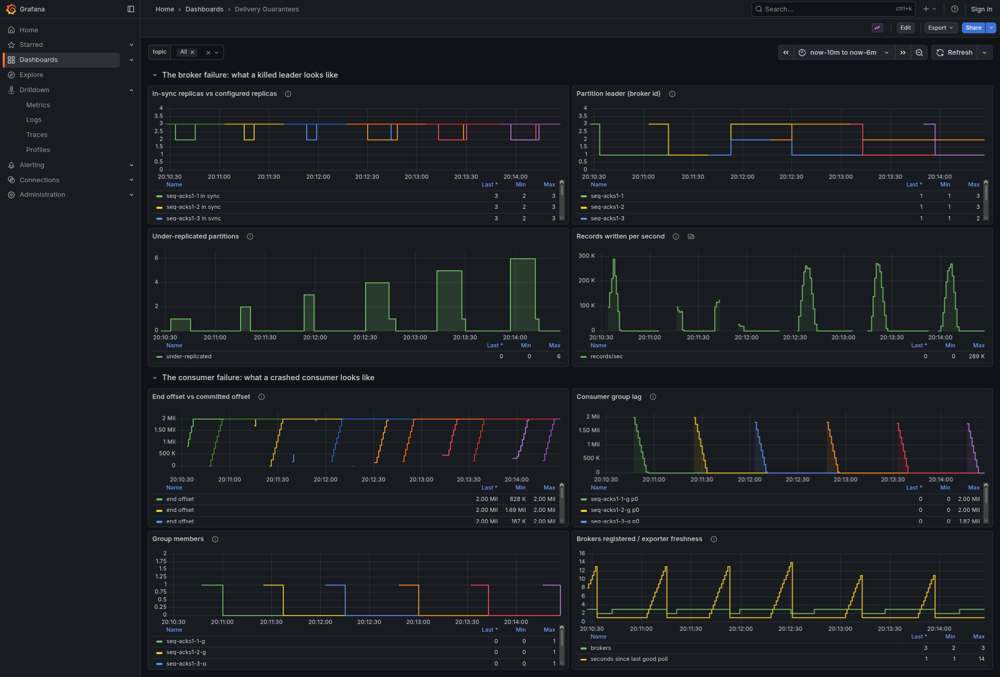
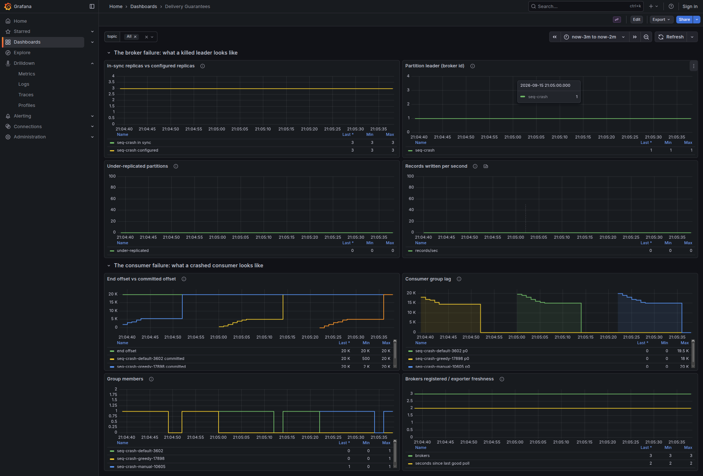

# Delivery Guarantees

- [The setup](#the-setup)
- [1. The leader dies mid-produce](#1-the-leader-dies-mid-produce)
- [2. What `min.insync.replicas` actually refuses](#2-what-mininsyncreplicas-actually-refuses)
- [3. One crash, three commit placements](#3-one-crash-three-commit-placements)

```bash
docker compose up --build
```

## The setup

[GitHub: franz-go producing and consuming.](https://github.com/twmb/franz-go/blob/master/docs/producing-and-consuming.md)

Prometheus here scrapes every **1s**, against a default of 15s.

- `topic` is split into N `partitions`, each a separate append-only log with its own offsets, its own leader and its own ordering.
- `partitions`: how many independent logs. In our experiment we just use 1 partition so it's easier to track all ids. Since we only have one consumer just 1 partition is enough.
- `rf` (replication factor): how many copies of each partition.
  - Replication factor 3 means each partition lives on 3 different brokers: one leader and two followers fetching from it.
  - It sets how many failures the data can survive at all.
  - It can't exceed the number of brokers.
  - It's fixed at creation in practice; changing it later means a partition reassignment, not a config flip.
- `min.insync.replicas`: how many copies must be done for `acks=all` to succeed. Can be changed easily.
- `acks` is a producer setting, sent on every producer request. Trades latency for safety.
  - `acks=0`: waits until the message is dispatched to the socket buffer. Does not wait for any response from the broker.
  - `acks=1`: waits until the partition leader receives the record and writes it to its local log.
  - `acks=all`: waits until the full set of ISR acknowledge the record.
- **High watermark**: the highest offset that has been successfully replicated across all ISRs for a partition. Consumers can only read messages up to the high watermark to prevent reading uncommitted data that might disappear if a leader fails.

The classic combination is `rf=3` and `min.isr=2`.

## 1. The leader dies mid-produce

```bash
# Finds the broker leading the partition and kills it. The graceful path (stop container) would have moved leadership first and lose nothing.
./acks.sh
```

| variant       |   acked | delivered | lost | duplicated | phantom | first gap      |
| ------------- | ------: | --------: | ---: | ---------: | ------: | -------------- |
| acks=1, try 1 | 2000000 |   1998543 | 1457 |          0 |       0 | 578386..579842 |
| acks=1, try 2 | 2000000 |   2000000 |    0 |          0 |       0 | -              |
| acks=all      | 2000000 |   2000000 |    0 |          0 |       0 | -              |

When the killed broker comes back it rejoins as a follower, discovers the new
leader's log diverges from its own, and deletes its extra records (`Truncating to offset 578385` as an INFO message, not an error):

```
[ReplicaFetcher replicaId=2, leaderId=3] Truncating partition seq-acks1-1-0 with
  TruncationState(offset=578385, completed=true) due to leader epoch and offset
  EpochEndOffset(errorCode=0, partition=0, leaderEpoch=0, endOffset=578385)
[UnifiedLog partition=seq-acks1-1-0] Truncating to offset 578385
```

The gap is **contiguous**. 579842 − 578386 + 1 = 1457, which means it is a _suffix of the log_ that only ever existed on one machine.

In `acks=all`:

- if the leader dies after ack: the records will be replicated from the new leader logs.
- if the leader dies before ack: the records will be removed from his log and retried by the producer.

`acks=1` loses whatever was in flight at the moment of a hard failure, and that is usually zero, because most of the time there is no hard failure at all (like the `SIGKILL` we did).

franz-go is `acks=all` plus the idempotent producer by default. It uses a `Producer ID` and `Sequence Numbers` to every message and removes duplicates.



| topic            | records lost | ISR | leader changed | under-replicated |
| ---------------- | -----------: | --- | -------------- | ---------------- |
| seq-acks1, try 1 |     **1457** | 3→2 | 1 → 2          | yes              |
| seq-acks1, try 2 |            0 | 3→2 | 1 → 2          | yes              |
| seq-acksall      |            0 | 3→2 | 2 → 3          | yes              |

The two rows that destroyed data are graphically identical to the four that
did not.

## 2. What `min.insync.replicas` actually refuses

Part 1 holds `min.insync.replicas=2` throughout, and it contributes nothing:
with three live brokers the ISR is full and `acks=all` waits for all three
either way. `min.insync.replicas` is not a setting about the healthy path. It
is the number the broker checks _before accepting_ an `acks=all` write, and it
only ever changes the answer once the ISR has already shrunk.

So shrink it. One broker killed, ISR 3 → 2, three topics that disagree about
whether that is still enough:

| topic           |  sent | acked | failed | first error                                    |
| --------------- | ----: | ----: | -----: | ---------------------------------------------- |
| rf=3, min.isr=1 | 10000 | 10000 |      0 | -                                              |
| rf=3, min.isr=2 | 10000 | 10000 |      0 | -                                              |
| rf=3, min.isr=3 | 10000 |     0 |  10000 | NOT_ENOUGH_REPLICAS: Messages are rejected ... |

- `min.isr=3` on a 3-replica topic means **a single broker loss is a full write outage**.
- `min.isr=1` is `acks=1` with extra steps.

The chain, in the order the write passes through it: `replication factor` sets
how many copies could exist, `min.insync.replicas` sets how many must
acknowledge before a write is accepted at all, and `acks` sets whether the
producer waits for that. Weakening any one of the three makes the other two
decorative.

## 3. One crash, three commit placements

```bash
./crash.sh
```

Killed with `exit(9)` immediately after record **5300**.

| variant                          | acked | delivered | lost | dupplicated | first gap  |
| -------------------------------- | ----: | --------: | ---: | ----------: | ---------- |
| greedy autocommit (java default) | 20000 |     19800 |  200 |           0 | 5301..5500 |
| franz-go default autocommit      | 20000 |     20300 |    0 |         300 | -          |
| commit after processing          | 20000 |     20300 |    0 |         300 | -          |

- **Greedy autocommit** commits what has been polled, on a 100ms timer. That timer fired while the batch was processed.
- **Franz-go's autocommit**: calling `PollFetches` is what tells the client you're done with the previous batch.



- **Consumer group lag**: the restart in every row waits 8 seconds. In our example `SessionTimeout` is 6s. Default is 45s.
